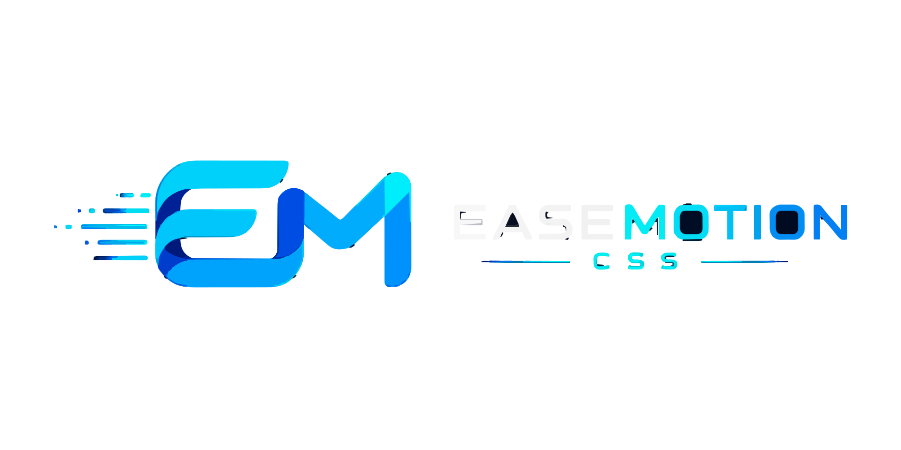

<div align="center">



<br/>

# ⚡ EaseMotion CSS

**A zero-dependency, animation-first CSS framework for faster, more expressive UI.**

EaseMotion CSS lets you build polished interfaces with readable class names such as `ease-fade-in`, `ease-slide-up`, and `ease-hover-grow`. No build step, no complex setup, and no need to memorize shorthand.

<br/>

[](https://www.npmjs.com/package/easemotion-css)
[](https://committers.top/india_public)
[](https://committers.top/india_private)
[](https://github.com/sponsors/SAPTARSHI-coder)
[](https://discord.gg/hWSdGrccBU)
[](https://www.npmjs.com/package/easemotion-css)
[](https://www.jsdelivr.com/package/npm/easemotion-css)
[](https://github.com/SAPTARSHI-coder/EaseMotion-css/stargazers)
[](https://github.com/SAPTARSHI-coder/EaseMotion-css/network/members)
[](https://github.com/SAPTARSHI-coder/EaseMotion-css/graphs/contributors)
[](https://github.com/SAPTARSHI-coder/EaseMotion-css/pulls?q=is%3Apr+is%3Amerged)
[](https://github.com/SAPTARSHI-coder/EaseMotion-css/pulls?q=is%3Apr+is%3Aclosed)
[](https://github.com/SAPTARSHI-coder/EaseMotion-css/issues?q=is%3Aissue+is%3Aclosed)
[](https://github.com/SAPTARSHI-coder/EaseMotion-css/pulls)
[](https://github.com/SAPTARSHI-coder/EaseMotion-css/issues)
[](./LICENSE)
[](https://gssoc.girlscript.tech/)

</div>

---

## 🌟 What is EaseMotion CSS?

EaseMotion CSS is a lightweight, animation-first CSS framework designed to help you build expressive, polished user interfaces without any build tools or external dependencies. With intuitive class names and a growing library of components and animations, you can focus on creativity instead of configuration.

---

## 📦 Installation

### Via CDN

```html
<link rel="stylesheet" href="https://cdn.jsdelivr.net/npm/easemotion-css/dist/easemotion.min.css" />
```

### Via npm

```bash
npm install easemotion-css
```

---

## 🚀 Quick Start

```html
<!DOCTYPE html>
<html lang="en">
<head>
  <meta charset="UTF-8" />
  <link rel="stylesheet" href="https://cdn.jsdelivr.net/npm/easemotion-css/dist/easemotion.min.css" />
</head>
<body>
  <div class="ease-fade-in">Hello, EaseMotion!</div>
</body>
</html>
```

---

## ✨ Features

- 🎨 **Animation-first** — fade, slide, bounce, flip, zoom, and more
- 🧩 **Component examples** — ready-to-use UI patterns in `submissions/examples/`
- ⚡ **Zero dependencies** — pure CSS with optional vanilla JS snippets
- 📱 **Responsive** — mobile-friendly by default
- 🔠 **Readable class names** — `ease-fade-in`, `ease-slide-up`, `ease-hover-grow`
- 🌙 **Dark mode friendly** — components designed with dark themes in mind

---

## 🧩 Example Components

Browse the `submissions/examples/` directory for ready-to-use component demos:

| Component | Description |
|-----------|-------------|
| `ease-airport-departure-screen` | Retro split-flap style airport departure board with live clock and flip animations |
| `ease-card-flip` | 3D card flip on hover |
| `ease-loader` | Animated loading spinners |
| `ease-toast` | Slide-in toast notifications |
| `ease-modal` | Fade-in modal dialogs |

### 🛫 ease-airport-departure-screen

A retro split-flap style airport departure board built with pure HTML, CSS, and vanilla JS.

**Features:**
- Classic airport-board look with dark panel and amber/cyan monospace text
- Live-updating clock in the header
- Split-flap style character reveal animation for destination names
- Status badges: On Time, Boarding, Delayed, Cancelled, Departed
- Pulse animation on urgent statuses (Boarding, Delayed)
- Fully responsive — collapses into a stacked layout on small screens
- No external dependencies

**Files:**
- `submissions/examples/ease-airport-departure-screen/demo.html`
- `submissions/examples/ease-airport-departure-screen/style.css`
- `submissions/examples/ease-airport-departure-screen/README.md`

---

## 📁 Project Structure

```
EaseMotion-css/
├── dist/                    # Compiled CSS output
├── docs/                    # Documentation assets
├── submissions/
│   └── examples/            # Community-contributed component demos
│       └── ease-airport-departure-screen/
│           ├── demo.html
│           ├── style.css
│           └── README.md
├── README.md
└── LICENSE
```

---

## 🤝 Contributing

We welcome contributions! Here's how to get started:

1. **Fork** this repository
2. **Create** a new branch: `git checkout -b feat/your-component-name`
3. **Add** your files inside `submissions/examples/your-component-name/`
4. **Include** `demo.html`, `style.css`, and `README.md`
5. **Submit** a Pull Request

Please make sure your submission:
- Lives entirely inside `submissions/`
- Has no external dependencies (or clearly documents them)
- Includes a working `demo.html`
- Follows existing naming conventions (`ease-*`)

---

## 📄 License

MIT © [SAPTARSHI-coder](https://github.com/SAPTARSHI-coder)

---

## 💖 Support

If you find EaseMotion CSS useful, consider:

- ⭐ **Starring** the repository
- 🐛 **Reporting** bugs via [Issues](https://github.com/SAPTARSHI-coder/EaseMotion-css/issues)
- 💬 **Joining** our [Discord Server](https://discord.gg/hWSdGrccBU)
- 💖 **Sponsoring** via [GitHub Sponsors](https://github.com/sponsors/SAPTARSHI-coder)