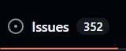
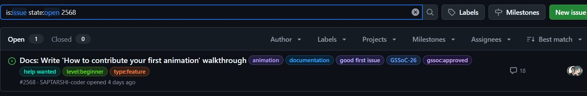
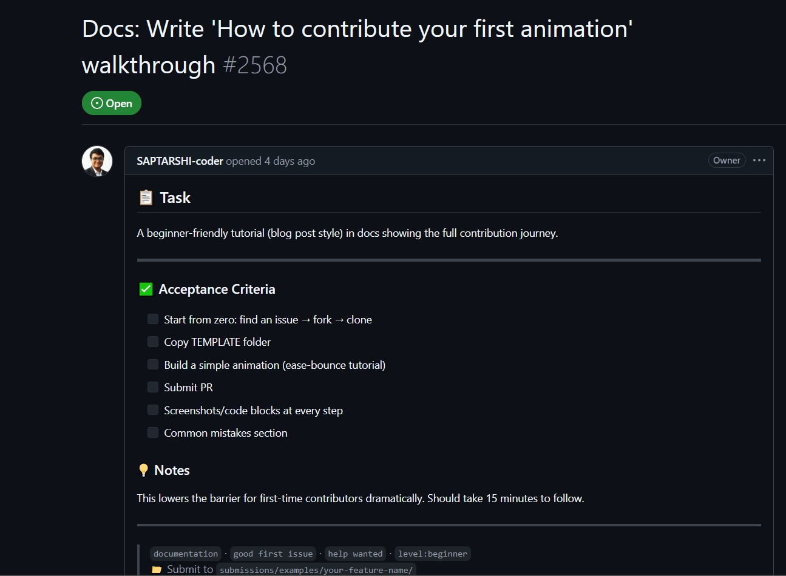
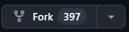
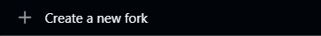
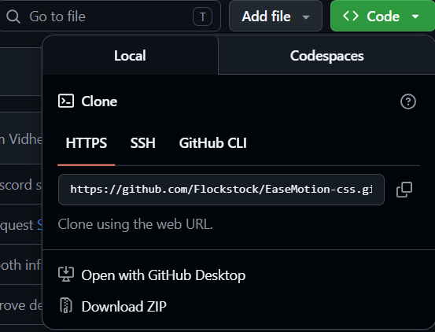
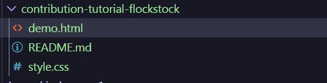
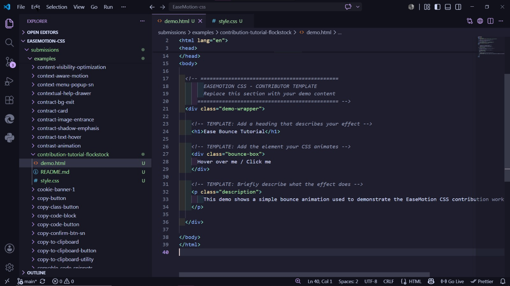
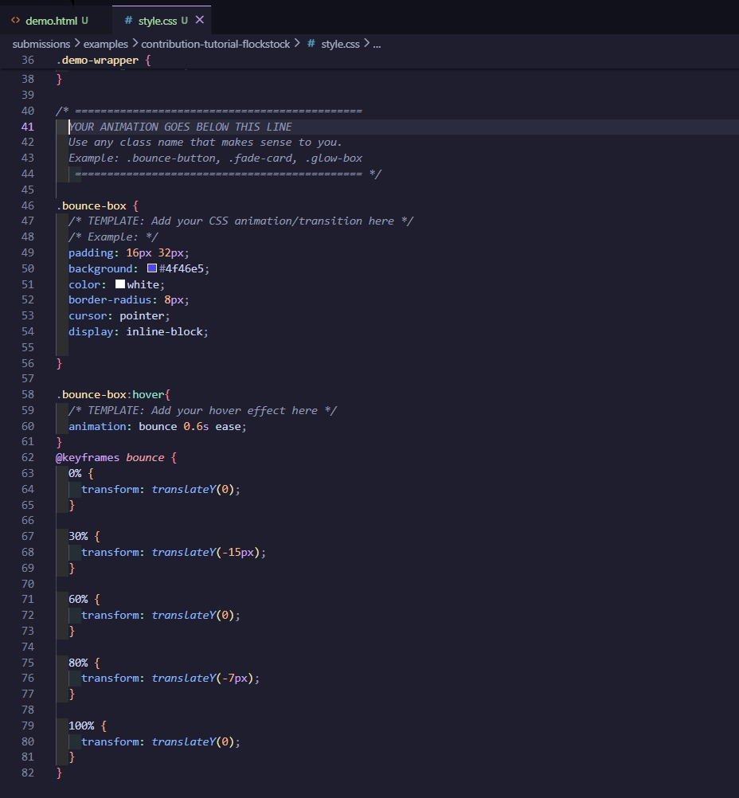

# Contribution Tutorial for Beginners
## Table of Contents

- What does this do
- How to use
- Find an issue
- Fork
- Clone
- Create animation
- Commit & Push
- Submit PR
- Common mistakes
- Tech Stack
- Preview
  
## What does this do?
This tutorial guides first-time contributors through the complete EaseMotion CSS contribution workflow.

## How is it used?
Add the class to any HTML element:

Follow the steps in this tutorial to:

### 1. Find an issue
Choose a beginner-friendly issue and read the requirements carefully.

<a href="./screenshots/01-find-issue-a.jpeg"></a>

<a href="./screenshots/01-find-issue-b.jpeg"></a>

<a href="./screenshots/01-find-issue-c.jpeg"></a>

### 2. Fork the repository
Create your own fork before making changes.

<a href="./screenshots/02-Fork-button.jpeg"></a>

<a href="./screenshots/03-fork-creation.jpeg"></a>

### 3. Clone your fork
Clone your fork locally and open it in VS Code.

<a href="./screenshots/04-clone-repo.png"></a> 

### 4. Copy the TEMPLATE folder
Go to:
submissions/examples/TEMPLATE
Copy the folder and rename it.

## Folder Structure

### Original structure

```plaintext
EaseMotion/
│
└── submissions/
    └── examples/
        └── TEMPLATE/
            ├── demo.html
            ├── style.css
            └── README.md
```

Example:

submissions/examples/contribution-tutorial-sky/

<a href="./screenshots/07-Template-copy.jpeg"></a>

## Folder Structure

```plaintext
contribution-tutorial-sky/
│
├── demo.html
├── style.css
├── README.md
└── screenshots/
```

### 5. Create a simple animation
Edit:
---

### demo.html

```html
<div class="bounce-box">Bounce Me</div>
```
<a href="./screenshots/08-demo-html.jpeg"></a>

### style.css
```css

.bounce-box{animation: bounce 1.2s infinite;}

```
<a href="./screenshots/09-style-css.jpeg"></a>

### README.md

Example class usage:

```html

<div class="bounce-box">Hover/Click Me</div>
```

HTML:
```html
<div class="bounce-box"></div>
```

CSS:
```css
.bounce-box{
 animation:bounce 1.2s infinite;
}
```
Preview: 

<video src="./screenshots/EaseMotiontutorial.mp4" width="800" controls autoplay loop muted playsinline></video>

### 6. Commit and push changes
Commit your work with a clear message.

Example:
git add .
git commit -m "Add contribution tutorial"

### 7. Submit a pull request
Push your branch and submit PR for review.


# Common Mistakes
- Editing core/
- Editing components/
- Forgetting README.md
- Missing style.css
- Editing TEMPLATE directly
- Wrong folder structure
- Forgetting to preview demo.html
- Not creating a dedicated branch.

## Why is it useful?
This tutorial lowers the barrier for first-time contributors by providing a complete walkthrough of the contribution process with screenshots and a working example.

## Tech Stack
-  HTML
-  CSS
-  Git
-  GitHub
-  VS Code

## Preview
Open demo.html directly in your browser to see the effect.

## Contribution Notes
- Class naming was handled by the contributor
- Maintainer will rename to ease-* convention before merging